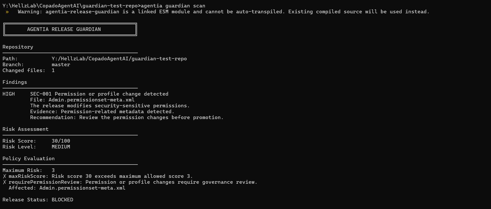
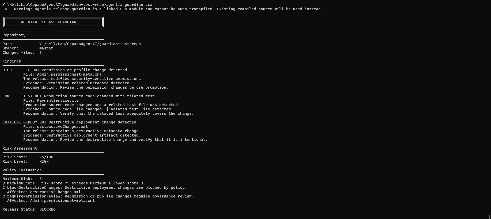
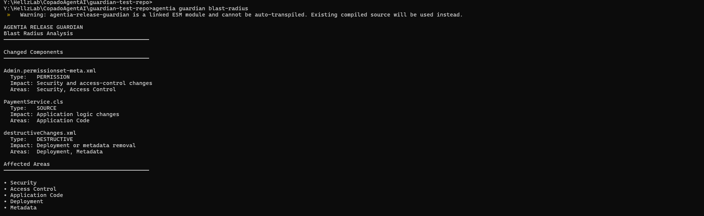
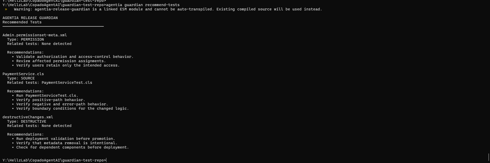
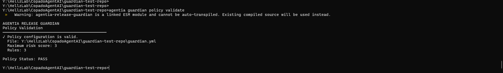

# Agentia Release Guardian

> **Know the release risk before you ship.**

Agentia Release Guardian is an Agentia CLI plugin for intelligent pre-deployment risk and governance analysis of Git repositories.

It analyzes changed files, identifies security-sensitive and destructive changes, checks test coverage signals, evaluates governance policies, calculates a deterministic release-risk score, and produces actionable recommendations before deployment.

---

## Why Release Guardian?

Modern releases contain much more than application code:

- Source-code changes
- Permission and access-control changes
- Metadata changes
- Deployment configuration
- Destructive changes
- Missing or incomplete test coverage

These risks are often reviewed manually or discovered late in CI/CD.

Release Guardian moves this analysis earlier in the development workflow.

Instead of asking only:

> "Did the build pass?"

Release Guardian asks:

> **"Is this release safe and compliant enough to promote?"**

---

## What It Does

Release Guardian provides a single Agentia CLI workflow for:

| Capability | Description |
|---|---|
| Risk scanning | Analyze repository changes before deployment |
| Security analysis | Detect permission and profile changes |
| Test analysis | Identify source changes and related test coverage signals |
| Destructive-change detection | Detect destructive deployment artifacts |
| Risk scoring | Calculate a deterministic 0–100 release-risk score |
| Policy-as-code | Apply configurable release governance rules |
| Blast-radius analysis | Identify potentially affected areas |
| Test recommendations | Recommend validation based on changed components |
| Explainability | Produce structured, AI-ready release context |
| Reporting | Generate JSON and Markdown reports |
| CI integration | Run automated build and test validation through GitHub Actions |

---

## Quick Example

A clean repository:

```text
Changed files: 0

No findings detected.

Risk Score:     0/100
Risk Level:     LOW

Policy requirements satisfied.

Release Status: PASS
```

A release containing permission, source-code and destructive changes:

```text
SEC-001       Permission or profile change detected       +30
TEST-001      Production source changed with related test  +5
DEPLOY-001    Destructive deployment change detected      +40

Risk Score:     75/100
Risk Level:     HIGH

Release Status: BLOCKED
### Clean Release



### Risky Release


```

The result is explainable: Guardian shows the affected file, evidence, recommendation, risk contribution, and policy violation.

---

## Architecture

```text
                         Git Repository
                               |
                               v
                    +----------------------+
                    |     Git Analyzer     |
                    +----------+-----------+
                               |
                               v
                    +----------------------+
                    |   File Classifier    |
                    +----------+-----------+
                               |
             +-----------------+-----------------+
             |                 |                 |
             v                 v                 v
          Source           Security          Deployment
           Risk              Risk               Risk
             |                 |                 |
             +-----------------+-----------------+
                               |
                               v
                    +----------------------+
                    |  Deterministic Risk  |
                    |       Engine         |
                    +----------+-----------+
                               |
                +--------------+--------------+
                |                             |
                v                             v
       +------------------+          +------------------+
       |   Policy Engine  |          | Impact Analysis |
       +--------+---------+          +--------+---------+
                |                             |
                +--------------+--------------+
                               |
                               v
                    +----------------------+
                    |   Release Decision   |
                    |     PASS/BLOCKED     |
                    +----------+-----------+
                               |
              +----------------+----------------+
              |                |                |
              v                v                v
          Terminal          JSON/MD        AI Explanation
```

---

## Risk Model

Guardian uses a deterministic scoring model.

Current risk contributions include:

| Finding | Severity | Score |
|---|---|---:|
| `SEC-001` Permission/profile change | HIGH | +30 |
| `TEST-001` Source change with related test | LOW | +5 |
| `TEST-001` Source change without related test | MEDIUM | +15 |
| `DEPLOY-001` Destructive deployment change | CRITICAL | +40 |

The total score is capped at 100.

Risk levels:

```text
0–29    LOW
30–59   MEDIUM
60–79   HIGH
80–100  CRITICAL
```

The release decision is determined by the Guardian engine and policy evaluation.

---

## Policy-as-Code

Release governance is defined in `guardian.yml`.

Example:

```yaml
maxRiskScore: 3

rules:
  requireTests: true
  blockDestructiveChanges: true
  requirePermissionReview: true
```

This allows teams to express release requirements as version-controlled configuration instead of relying only on manual review.

Validate the policy with:

```bash
agentia guardian policy validate
```

Example:

```text
Policy configuration is valid.
Maximum risk score: 3
Rules: 3

Policy Status: PASS
```

A valid policy configuration does not mean every release passes the policy. Guardian evaluates each release against the configured rules.

---

## CLI Commands

### Scan a repository

```bash
agentia guardian scan
```

Analyzes the current Git repository and produces the release-risk assessment.

---

### Validate governance policy

```bash
agentia guardian policy validate
```

Validates the `guardian.yml` configuration.

---

### Explain the release

```bash
agentia guardian explain
```

Produces a human-readable explanation of the release findings.

For structured, AI-ready context:

```bash
agentia guardian explain --json
```

---

### Analyze blast radius

```bash
agentia guardian blast-radius
```

Maps changed components to potentially affected areas such as:

```text
Security
Access Control
Application Code
Deployment
Metadata
```

---

### Recommend tests

```bash
agentia guardian recommend-tests
```

Generates validation recommendations based on the changed components and detected related tests.

---

### Generate JSON report

```bash
agentia guardian report --format json
```

Produces machine-readable release information suitable for automation, CI/CD and downstream tooling.

---

### Generate Markdown report

```bash
agentia guardian report --format markdown
```

Produces a human-readable release report containing:

- Release summary
- Risk score
- Findings
- Evidence
- Recommendations
- Policy evaluation
- Policy violations
- Release status

---

## Example Findings

### SEC-001 — Permission or profile change

```text
Severity: HIGH
Score:    +30

The release modifies security-sensitive permissions.

Recommendation:
Review the permission changes before promotion.
```

---

### TEST-001 — Source/test relationship

```text
Severity: LOW
Score:    +5

Production source code changed and a related test file was detected.

Recommendation:
Verify that the related test adequately covers the change.
```

---

### DEPLOY-001 — Destructive deployment change

```text
Severity: CRITICAL
Score:    +40

The release contains a destructive metadata change.

Recommendation:
Review the destructive change and verify that it is intentional.
```

---

## Blast-Radius Analysis

Guardian provides context beyond the raw risk score.

For example:

```text
Admin.permissionset-meta.xml
    Type:   PERMISSION
    Impact: Security and access-control changes
    Areas:  Security, Access Control

PaymentService.cls
    Type:   SOURCE
    Impact: Application logic changes
    Areas:  Application Code

destructiveChanges.xml
    Type:   DESTRUCTIVE
    Impact: Deployment or metadata removal
    Areas:  Deployment, Metadata
```

This helps reviewers understand **where the release can have an impact**, not just whether a rule was triggered.
### Example


---

## Recommended Tests

Guardian turns findings into actionable validation guidance.

For a source-code change:

```text
Related tests: PaymentServiceTest.cls

Recommendations:
- Run PaymentServiceTest.cls.
- Verify positive-path behavior.
- Verify negative and error-path behavior.
- Verify boundary conditions for the changed logic.
```

For permission changes:

```text
Recommendations:
- Validate authorization and access-control behavior.
- Review affected permission assignments.
- Verify users retain only the intended access.
```

For destructive changes:

```text
Recommendations:
- Run deployment validation before promotion.
- Verify that metadata removal is intentional.
- Check for dependent components before deployment.
```
### Example


---

## AI-Ready Explanation

Guardian deliberately separates **risk determination** from **AI explanation**.

The structured explanation contract states:

```json
{
  "explanationContract": {
    "riskDecisionSource": "deterministic-guardian-engine",
    "aiRole": "Interpret and explain Guardian findings without changing the risk decision."
  }
}
```

This architecture keeps the underlying risk decision deterministic and auditable while allowing AI to provide richer explanations of the findings.

In other words:

```text
Repository Changes
       |
       v
Deterministic Guardian Engine
       |
       +---- Risk Decision
       |
       +---- Findings
       |
       v
Structured Explanation Context
       |
       v
AI Explanation Layer
```

AI explains the result; it does not silently change the underlying risk decision.

---
### Example




## Reporting

Guardian supports both machine-readable and human-readable reporting.

### JSON

```bash
agentia guardian report --format json
```

Useful for:

- CI/CD pipelines
- Automation
- Audit processing
- Downstream tooling

### Markdown

```bash
agentia guardian report --format markdown
```

Useful for:

- Release reviews
- Documentation
- Human-readable audit records
- Pull request or deployment summaries

---

## Installation

### Prerequisites

- Node.js 22+
- npm
- Git
- Copado Agentia CLI

Install the Agentia CLI:

```bash
npm install -g @copado/agentia-cli@beta --registry https://registry.npmjs.org
```

Install dependencies:

```bash
npm install
```

Build the plugin:

```bash
npm run build
```

For local Agentia CLI development, link the plugin from the plugin directory:

```bash
agentia plugins link .
```

Verify the plugin:

```bash
agentia plugins inspect agentia-release-guardian
```

Then:

```bash
agentia guardian --help
```

---

## Development

Clone the repository:

```bash
git clone https://github.com/KarthikKKulkarni/agentia-release-guardian.git
cd agentia-release-guardian
```

Install dependencies:

```bash
npm install
```

Build:

```bash
npm run build
```

Run tests:

```bash
npm test
```

The project currently contains:

```text
7 test files
39 automated tests
```

---

## Testing

The test suite covers:

- Risk scoring
- Risk levels
- File classification
- Security findings
- Test coverage findings
- Destructive changes
- Policy evaluation
- Blast-radius analysis
- Test recommendations
- Scanner integration

Integration tests create temporary Git repositories, making them independent of the developer's local filesystem path.

Run:

```bash
npm test
```

Expected result:

```text
Test Files  7 passed
Tests       39 passed
```

---

## Continuous Integration

GitHub Actions runs the project validation pipeline on pushes and pull requests.

The CI workflow performs:

```text
Checkout
   |
   v
Node.js 22
   |
   v
npm ci
   |
   v
npm run build
   |
   v
npm test
```

This ensures that the plugin continues to build and pass its automated test suite after changes.

---

## Project Structure

```text
agentia-release-guardian/
|
├── src/
│   ├── analyzers/
│   │   ├── git.ts
│   │   ├── file-classifier.ts
│   │   └── risk-analyzer.ts
│   │
│   ├── config/
│   │   └── policy.ts
│   │
│   ├── engine/
│   │   ├── blast-radius.ts
│   │   ├── policy-engine.ts
│   │   ├── risk-engine.ts
│   │   ├── scanner.ts
│   │   └── types.ts
│   │
│   ├── reporters/
│   │   ├── json.ts
│   │   └── markdown.ts
│   │
│   ├── commands/
│   │   └── guardian/
│   │
│   └── tests/
│
├── .github/
│   └── workflows/
│       └── ci.yml
│
├── guardian.yml
├── package.json
├── tsconfig.json
└── README.md
```

---

## Design Principles

### Deterministic risk decisions

Risk scoring and policy decisions are produced by explicit rules rather than depending on an AI model to make the final release decision.

### Explainability

Every finding contains:

- Finding ID
- Category
- Severity
- Affected file
- Evidence
- Recommendation
- Score contribution

### Policy-as-code

Release governance can be version-controlled alongside the project.

### Actionable results

Guardian goes beyond detection by providing:

- Blast-radius analysis
- Test recommendations
- Human-readable explanations
- JSON and Markdown reports

### CI/CD friendly

The CLI can be incorporated into automated release workflows.

---

## Hackathon Project

**Agentia Release Guardian — Intelligent Pre-Deployment Risk & Governance**

### Tagline

> **Know the release risk before you ship.**

The project demonstrates how an Agentia CLI plugin can bring release-risk analysis and governance earlier into the software delivery lifecycle.

---

## License

This project is provided for the Copado Agentia CLI Hackathon.